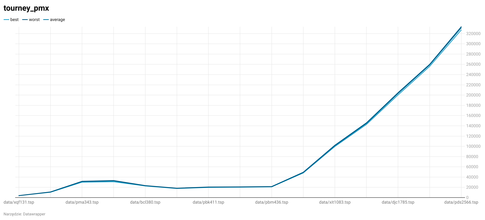
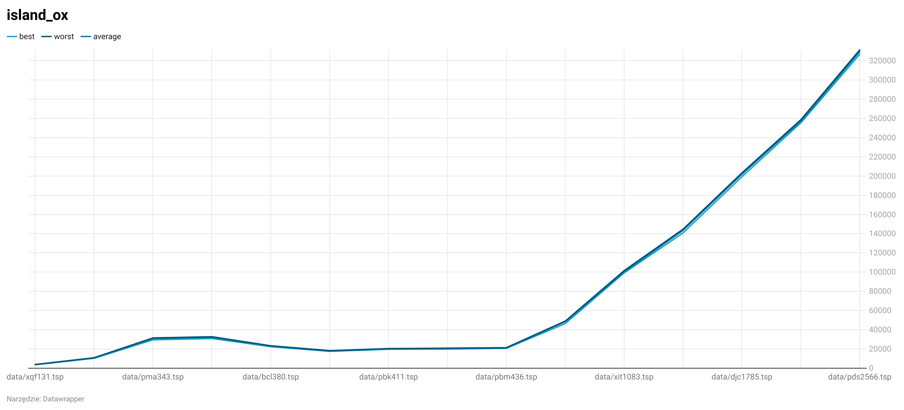
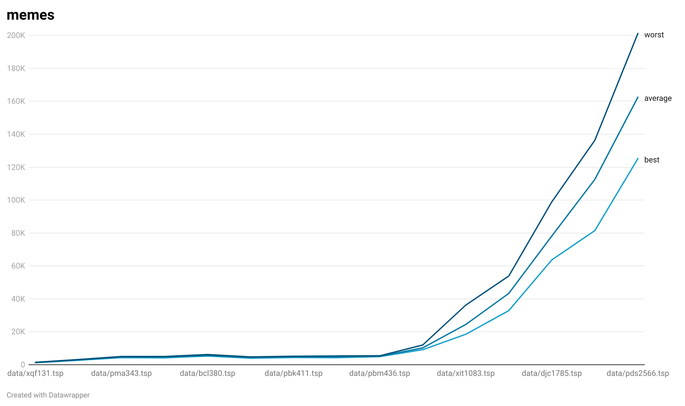
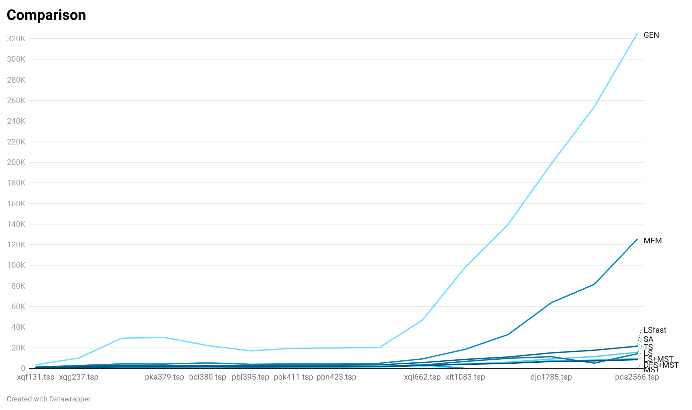
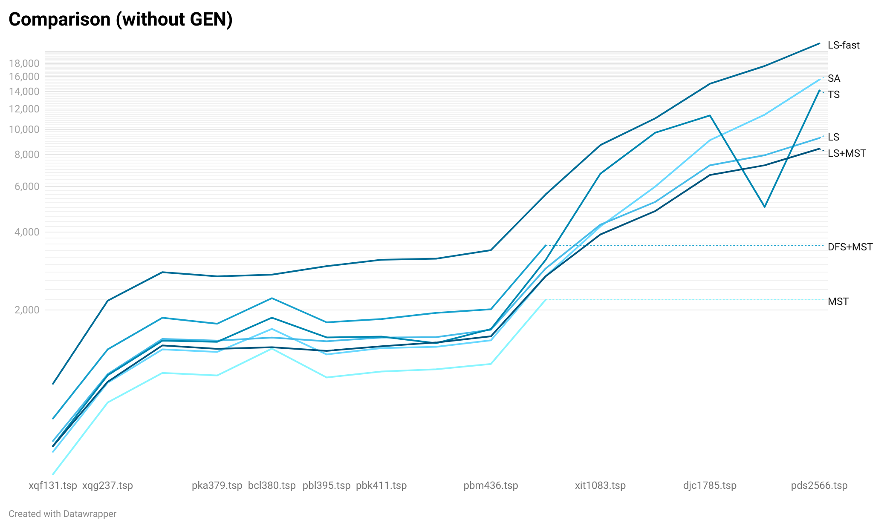

# Sprawozdanie

### Generowania populacji

Utworzenie losowych permutacji

### Selekcja

Selekcja losowa, turniej oraz turniej z podziałem na wyspy. Na rodziców wybierana jest połowa osobników.

### Krzyżowanie

Partially Mapped Crossover Operator (PMX) oraz Order Crossover Operator (OX),
zaimplementowane korzystając z [artykułu na hindawi.com](https://www.hindawi.com/journals/cin/2017/7430125/)

### Mutacja

20% szansy na 1 swap losowych wierzchołków, 20% na 2 swapy, 10% na 3.

### Warunek stopu

Określona liczba generacji bez poprawy

### Równoległość

Przy uruchomieniu można podać liczbę wątków do wykorzystania, 100 wykonań algorytmu jest na nie w miarę możliwości równo rozłożone, po wykonaniu testu raportują wyniki.

### Algorytm memetyczny

Do tego wykorzystałem LocalSearch z małą liczbą kroków poprawy.

## Wyniki

### Selekcja turniej i krzyżowanie PMX

### Selekcja turniej i krzyżowanie OX

### Selekcja turniej-wyspa i krzyżowanie OX

### Algorytm z użyciem memów

## Podsumowanie

 

Algorytm genetyczny wypadł zdecydowanie najsłabiej tworząc rozwiązania niewiele lepsze od losowej permutacji, algorytm oparty na memach wypadł dobrze mimo że wyniki były wygenerowane szybko (w ciągu paru minut)

Ze wszystkich algorytmów najkrótszy cykl zazwyczaj znajdował LocalSearch, TabuSearch wypadł słabiej z powodu
zmniejszonych parametrów z uwagi na przedłużony czas trwania przez przeszukiwaniem listy tabu, Symulowane wyżarzanie znajdowało dobry wynik jak na krótki czas wykonywania (kilka godzin dla LS/TS, ok. 10 min dla SA), trochę słabiej wypadł LS przeszukujący tylko fragment sąsiedztwa.