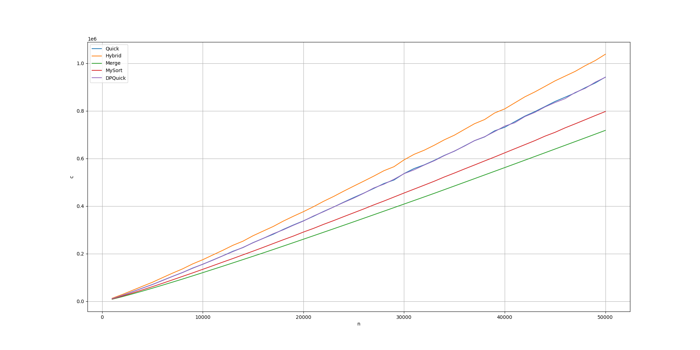

# Sprawozdanie

## Zad. 1

Implementacja insertionsorta, quicksorta i hybrid sorta znajdują się odpowiednio w plikach:
- `insertionsort.hpp`
- `quicksort.hpp`
- `hybridsort.hpp`

Pomocnicze pliki:
- `gen.hpp` - funkcje do generowania tablic
- `key.hpp` - implementacja kluczy zliczających operacje
- `sort.hpp` - interfejs funkcji sortujących

Pliki wykonywalne:
- `bin/test` - program testujący powyższe
- `bin/sort` - program do sortowania tablicy danej na wejściu
- `bin/generate` - program do generowania tablicy

## Zad. 2

### Wyniki:

### N: 10 -> 50

C             |  A
:-------------------------:|:-------------------------:
  |  
C/N                        |  A/N
 |  

### N: 1.000 -> 50.000

C             |  A
:-------------------------:|:-------------------------:
  |  
C/N                        |  A/N
 |  

## Zad. 3

Implementacja mojego algorytmu znajduje się w pliku `mysort.hpp`.

### Działanie:
-   Przejście przez klucze i podział na "runy"
- - Przy natrafieniu na spadek klucza zaczynamy nowy run
- - Runy są wewnętrznie posortowane
-   Scalanie runów w parach wybierając najmniejszy run
- - Powtórz dopóki nie zostanie jeden run
-   Koniec

### Zad. 4

Implementacja Dual-Pivot QuickSorta znajduje się w `dpquicksort.hpp`.