# Sprawozdanie

## Zad. 1

Implementacja selecta i randomized-selecta w plikach:
- `select.hpp`
- `randomselect.hpp`

Pliki wykonywalne:
- `bin/search` uruchamianie selecta/ranomized-selecta na podanej tablicy
- `bin/generate` generowanie tablicy o podanym rozmiarze

## Zad. 2 i 3

Implementacja selecta z podziałem na k podtablic w pliku:
- `kselect.hpp`

Plik wykonywalny:
- `bin/main` wykonanie na wszystkich algorytmach benchmarku z podanymi w zadaniach parametrach
- `plot.py` generowanie wykresów z wyników benchmarku

### Wyniki

#### Liczba przypisań
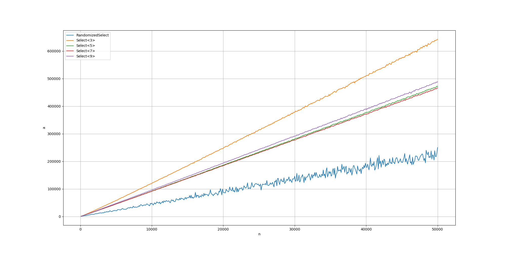
#### Liczba przypisań / N
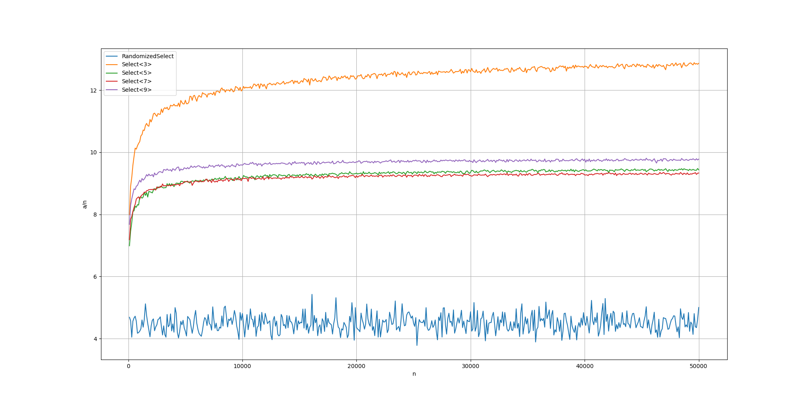
#### Liczba porównań
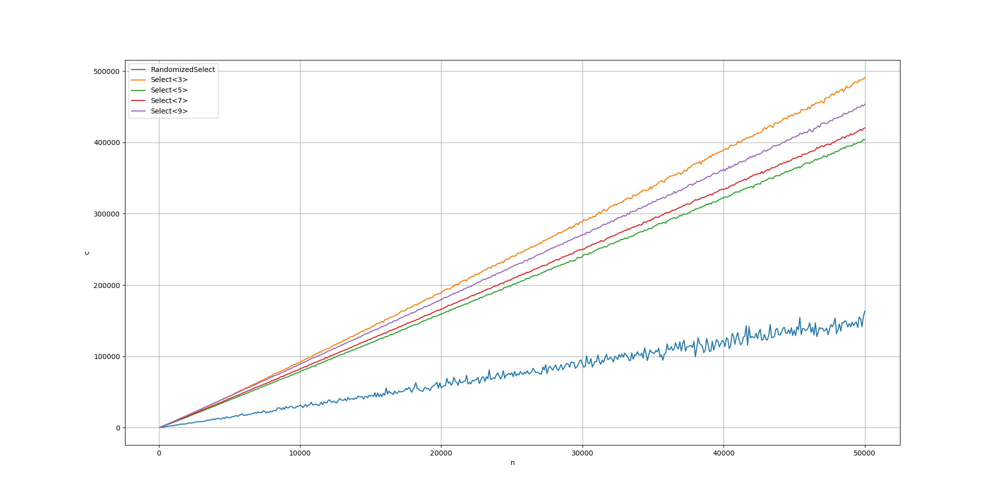
#### Liczba porównań / N
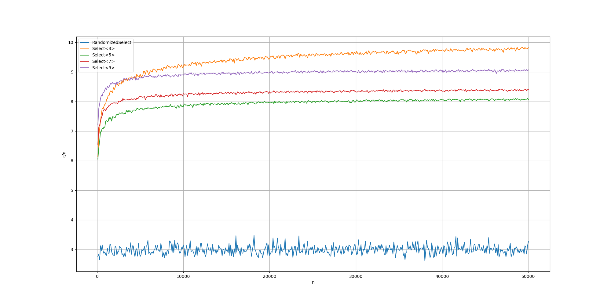

### Wnioski
Widać że pomimo tego że algorytm select ma mniejszą złożoność obliczeniową (w worst case) to w praktyce jest wolniejszy od sporo prostszego algorytmu randomized-select. Dla selecta z podziałem na k podtablic widać też że (oprócz 3) zmiana k nie wpływa znacząco na liczbę przypisań i porównań.

## Zad. 4

Implementacja algorytmu binary-search w pliku:
- `binarysearch.hpp`

Plik wykonywalny:
- `bin/bsearch` uruchamianie binary-searcha na podanej tablicy, zwraca 0 jeśli element jest w tablicy, 1 jeśli nie ma oraz wypisuje statystyki
- `bin/main` wykonanie na binary-searchu benchmarku z podanymi w zadaniu parametrami

### Wyniki

#### Liczba porównań
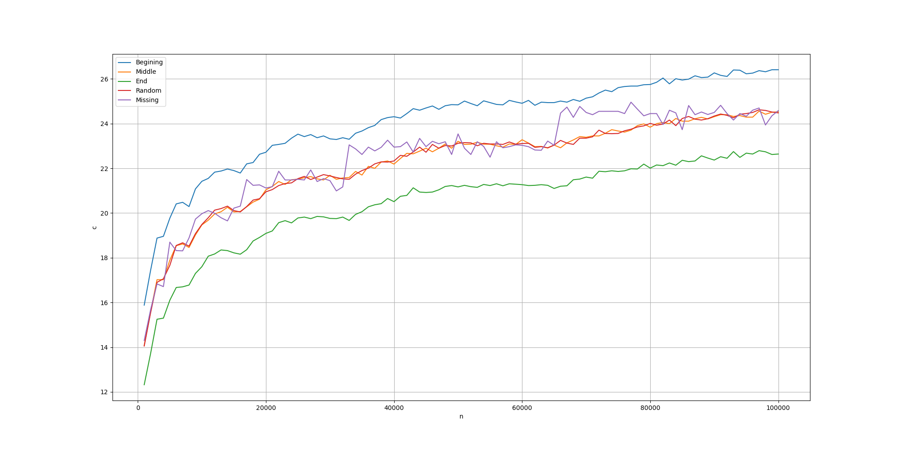
#### Liczba porównań / N
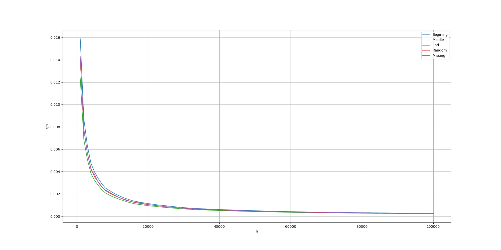
#### Czas działania algorytmu (w ns)
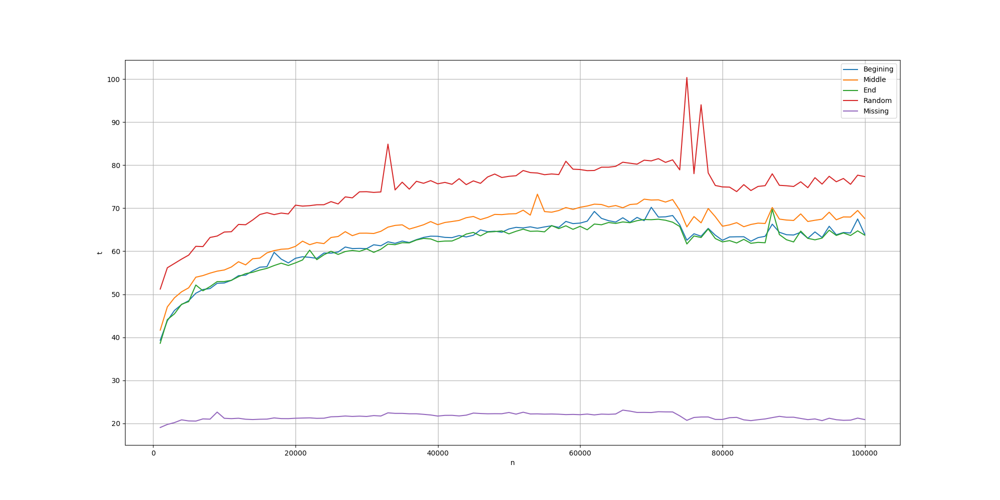
#### Czas działania algorytmu / N
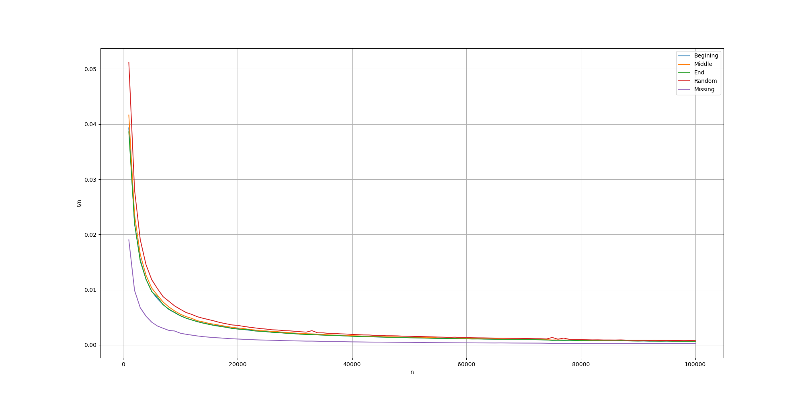

## Zad. 5

Implementacja algorytmów quicksort i dpquicksort z wykorzystaniem selecta w pliku:
- `myquicksort.hpp`

Pliki wykonywalne:
- `bin/sort` uruchamianie quicksorta/dpquicksorta na podanej tablicy
- `bin/main` wykonanie na wszystkich algorytmach benchmarku

### Wyniki

#### Liczba przypisań
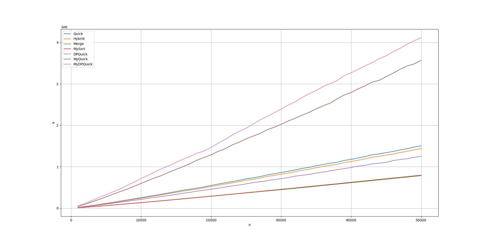
#### Liczba przypisań / N
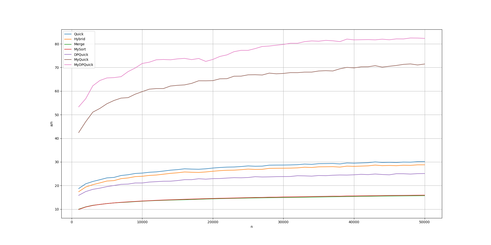
#### Liczba porównań
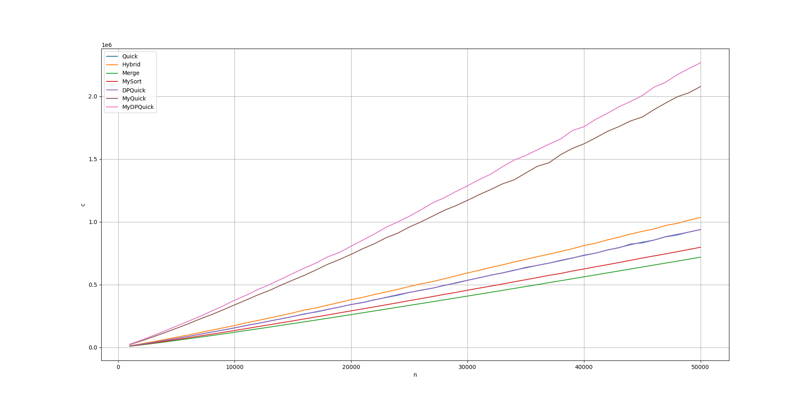
#### Liczba porównań / N
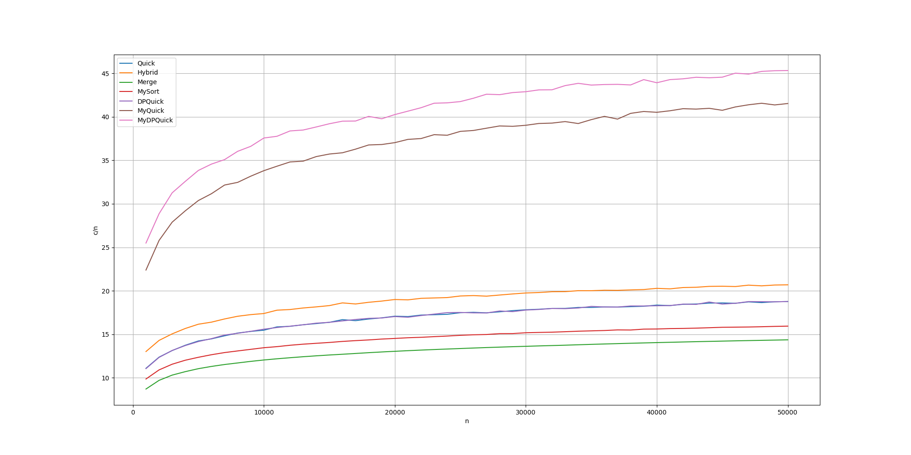

### Wnioski

Moje algorytmy z wykorzystaniem selecta są znacznie wolniejsze od standardowych quicksortów. Może to wynikać z tego że używając randomized-selecta zamiast partitiona wykonywane są dodatkowe operacje które nie są konieczne. DPQuicksort jest też znacznie wolniejszy od Quicksorta ponieważ wykonuje on jeszcze więcej randomized-selectów.

### Porównanie worst-case

#### Liczba przypisań
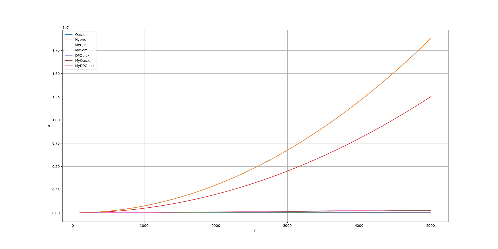
#### Liczba przypiań / N
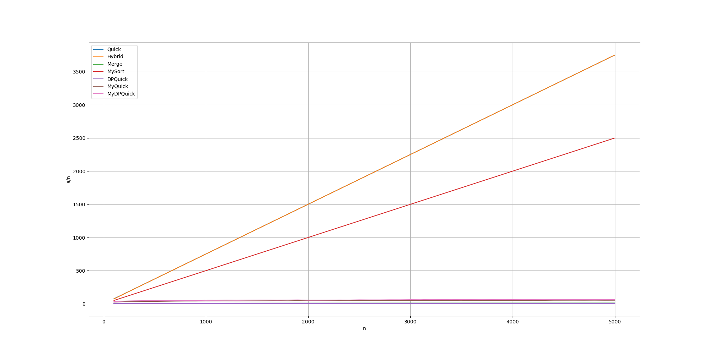
#### Liczba porównań
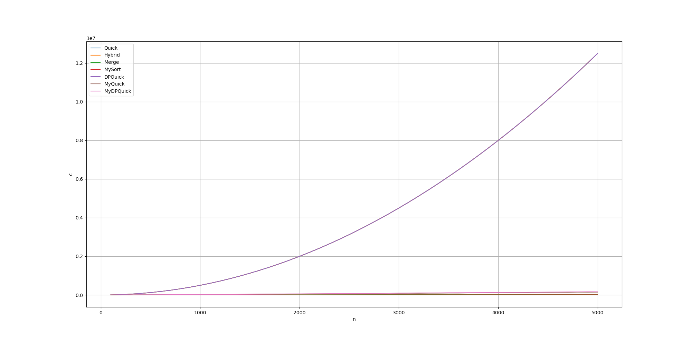
#### Liczba porównań / N
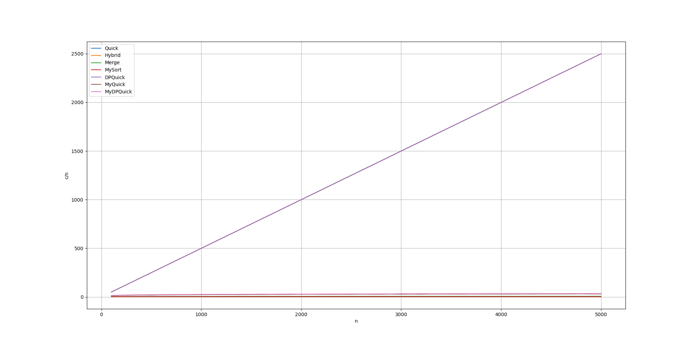