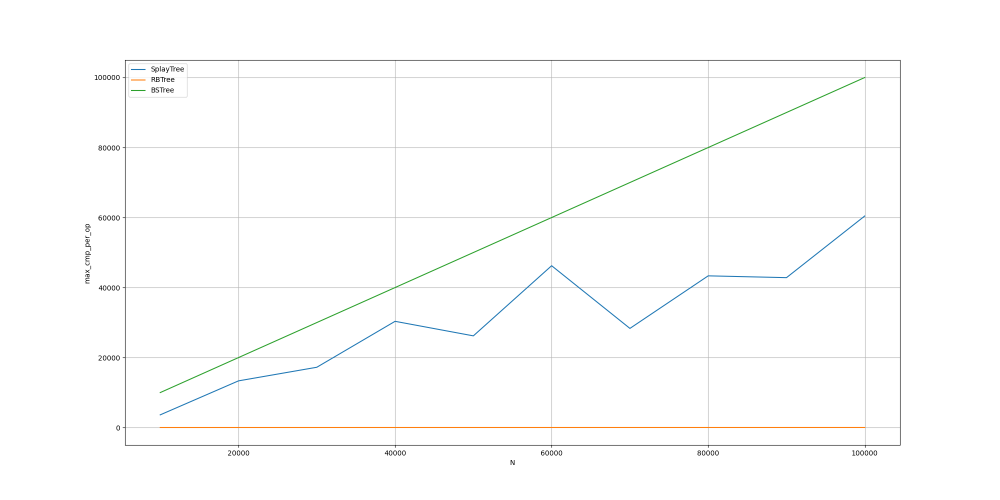

# Sprawozdanie

## Wykresy

### 1. Dane losowe

#### Wysokość drzew

#### Liczba porównań między kluczami

#### Liczba odczytów wskaźników

#### Liczba zapisów wskaźników

#### Max. liczba porównań między kluczami w jednym wywołaniu

#### Max. liczba odczytów wskaźników w jednym wywołaniu

#### Max. liczba zapisów wskaźników w jednym wywołaniu

### 2. Dane posortowane

#### Wysokość drzew

#### Liczba porównań między kluczami

#### Liczba odczytów wskaźników

#### Liczba zapisów wskaźników

#### Max. liczba porównań między kluczami w jednym wywołaniu

#### Max. liczba odczytów wskaźników w jednym wywołaniu

#### Max. liczba zapisów wskaźników w jednym wywołaniu

