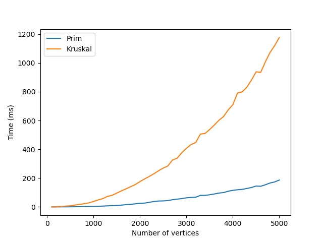
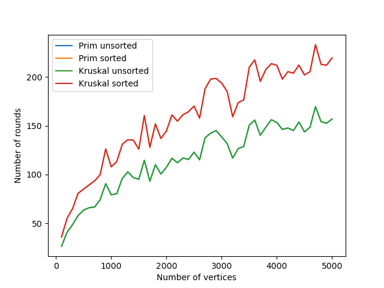

# Sprawozdanie

### Implementacja znajduje się w plikach
- `Graph.hpp`   - klasa reprezentująca graf
- `Prim.hpp`    - funkcja realizująca algorytm Prima
- `Kruskal.hpp` - funkcja realizująca algorytm Kruskala
- `Tree.hpp`    - pomocnicza klasa reprezentująca drzewo rozpinające

### Test
Przykładowe wykonanie programu `test.cpp` dla algorytmu Prima i grafie pełnym o 20 wierzchołkach:
```console
$ ./bin/test Prim 20
└──[]
    └──[]
        ├──[]
        │   ├──[]
        │   │   ├──[]
        │   │   └──[]
        │   │       ├──[]
        │   │       │   ├──[]
        │   │       │   │   └──[]
        │   │       │   │       └──[]
        │   │       │   │           └──[]
        │   │       │   └──[]
        │   │       │       └──[]
        │   │       └──[]
        │   │           ├──[]
        │   │           └──[]
        │   └──[]
        │       ├──[]
        │       └──[]
        └──[]
```

### Eksperymenty
Pliki `generate_results.cpp` i `generate_results2.cpp` generują wyniki dla odpowiednio zadań 1 i 2.
Wyniki te zamieniane są w wykresy za pomocą skryptów `plot.py` i `plot2.py`.

### Zad. 1
Czas wykonania algorytmów w zależności od liczby wierzchołków w grafie.
Wyniki dla algorytmu Prima są znacznie lepsze niż dla Kruskala, jednak po profilowaniu okazało się że w algorytmie Kruskala najwięcej czasu zajmuje sortowanie krawędzi którego nie da się zoptymalizować.



### Zad. 2
Na wykresie widać tylko dwie linie, ponieważ oba algorytmy zwracają to samo drzewo rozpinające dla tego samego grafu. Widać też że liczba rund zmnejszyła się po posortowaniu kolejności informowanych wierzchołków po wielkości poddrzew.


