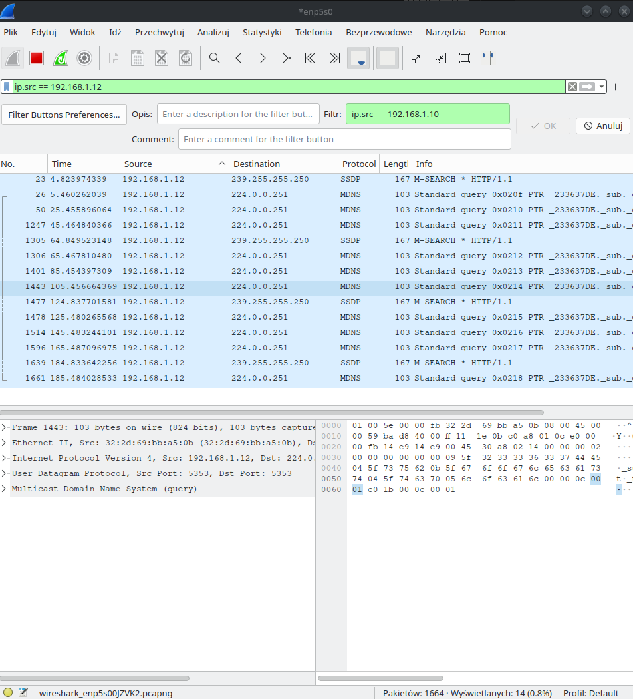

## Ping

Ping – polecenie używane w sieciach komputerowych TCP/IP (jak Internet) i służące do diagnozowania połączeń sieciowych. Pozwala na sprawdzenie, czy istnieje połączenie pomiędzy hostami testującym i testowanym. Umożliwia on zmierzenie liczby zgubionych pakietów oraz opóźnień w ich transmisji, zwanych lagami. 

> ping -4 -c 4 amazon.com

Wynik:

```
PING amazon.com (52.94.236.248) 56(84) bytes of data.
64 bytes from 52.94.236.248: icmp_seq=1 ttl=243 time=142 ms
64 bytes from 52.94.236.248: icmp_seq=2 ttl=243 time=142 ms
64 bytes from 52.94.236.248: icmp_seq=3 ttl=243 time=142 ms
64 bytes from 52.94.236.248: icmp_seq=4 ttl=243 time=142 ms

--- amazon.com ping statistics ---
4 packets transmitted, 4 received, 0% packet loss, time 3005ms
rtt min/avg/max/mdev = 141.775/142.127/142.403/0.235 ms
```

`52.94.236.248` - Adres IP serwera o domenie `amazon.com`

`icmp_seq=1` - Numer sekwencji pakietu

`ttl=243` - Time to live, czyli czas życia pakietu

`time=142 ms` - Czas odpowiedzi serwera

`4 packets transmitted, 4 received, 0% packet loss` - Liczba wysłanych i odebranych pakietów oraz procentowy brak pakietów

`rtt min/avg/max/mdev = 141.775/142.127/142.403/0.235 ms` - Statystyki czasu odpowiedzi serwera

### Liczba węzłów a odległość

Korzystając z parametru `-t` można ustalić ttl dla pakietów. Dzięki temu można określić liczbę węzłów na drodze do serwera.

| TTL ->    | TTL <- | Adres IP          | Nazwa hosta   | Odległość |
| ---       | ---    | ---               | ---           | ---       |
| 1         | 1      | 127.0.0.1         | localhost     | 0 km      |
| 6         | 4      | 212.77.98.9       | wp.pl         | 350 km    |
| 17        | 9      | 54.239.28.85      | amazon.com    | 7216 km   |
| 20        | 17     | 109.244.194.121   | tencent.com   | 8438 km   |

### Liczba węzłów a rozmiar pakietu, maksymalny rozmair pakietu

Nie ma związku pomiędzy liczbą węzłów a rozmiarem pakietu. Maksymalny rozmiar pakietu na jaki uzyskiwałem odpowiedź to 1472 bajty.

### Wielkość pakietu a czas propagacji

Zwiększając wielkość pakietu nie zwiększa się czas propagacji.

### Fragmentacja pakietów

Fragmentację można wyłączyć za pomocą parametru `-M`.
Liczba węzłów ani czas propagacji nie zmieniają się. Tak samo maksymalny rozmiar pakietu ponieważ większy jest odrzucany `"ping: local error: message too long, mtu=1500"`.

### Wpływ sieci wirutalnych na liczbę węzłów

Użycie sieci VPN znacznie zwiększa liczbę węzłów na trasie do serwera, np. w przypadku chińskiej wersji strony dota2.com wynosi ona 38, podczas gdy dla wersji z USA jest to tylko 7, pomimo tego że wersja chińska ficzyznie znajduje się znacznie bliżej (w Niemczech).

| TTL | Nazwa hosta         | Odległość |
| --- | ---                 | ---       |
| 7   | www.dota2.com           | 9366 km   |
| 38  | www.dota2.com.cn    | 726 km    |

## Traceroute

Traceroute – polecenie używane w sieciach komputerowych TCP/IP (jak Internet) i służące do diagnozowania połączeń sieciowych. Pozwala na określenie trasy, jaką pakiet musi przebyć, aby dotrzeć z jednego hosta do drugiego.

> traceroute -I amazon.com

Wynik:

```
traceroute to amazon.com (205.251.242.103), 30 hops max, 60 byte packets
 1  _gateway (192.168.1.1)  0.513 ms  0.738 ms  0.939 ms
 2  192.0.0.1 (192.0.0.1)  22.762 ms  23.035 ms  23.109 ms
 3  195.205.0.81 (195.205.0.81)  23.996 ms  24.049 ms  24.230 ms
 4  195.116.35.201 (195.116.35.201)  26.450 ms  26.807 ms  26.796 ms
 5  ae104-10.ffttr6.frankfurt.opentransit.net (193.251.249.15)  48.140 ms  48.411 ms  48.569 ms
 6  81.52.166.175 (81.52.166.175)  144.317 ms * *
 7  81.52.187.214 (81.52.187.214)  143.269 ms * *
 8  * * *
 9  * * *
10  * * *
11  * * *
12  * * *
13  * * *
14  * * *
15  * * *
16  * * *
17  * * *
18  * * *
19  * * *
20  s3-console-us-standard.console.aws.amazon.com (205.251.242.103)  142.261 ms  142.465 ms  142.761 ms
```

Pokazuje nam kolejne węzły na trasie do serwera. Dla każdego węzła pokazuje adres IP, nazwę hosta, czas odpowiedzi oraz odległość.

`* * *` - przekroczenie czasu oczekiwania na odpowiedź

## Wireshark

Wireshark – program do analizy pakietów sieciowych. Pozwala na przechwytywanie i analizę ruchu sieciowego.


Przykładowe użycie programu Wireshark do wyświetlenia pakietów wychodzących z innego komputera w sieci lokalnej.
