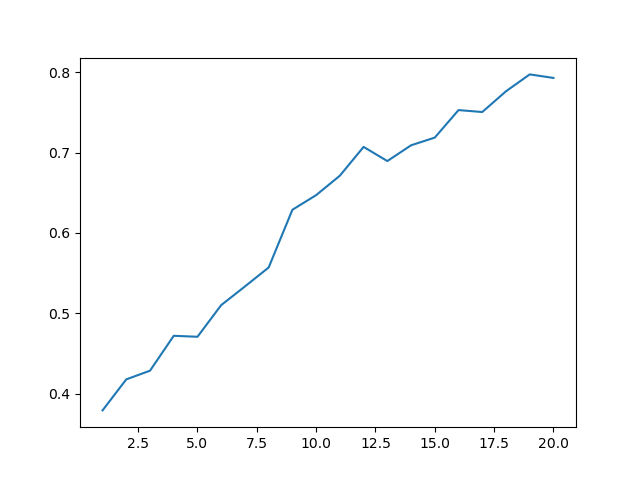

# Sprawozdanie

## Graf:

## Macierz natężeń:
#### N(i,j) - losowa liczba z zakresu 1-10, 0 jeśli i=j
| |||||||||||||||||||||
|-|-|-|-|-|-|-|-|-|-|-|-|-|-|-|-|-|-|-|-|-|
||0|6|10|7|9|7|5|10|5|6|2|7|4|3|3|3|4|7|3|4|
||3|0|9|7|4|4|4|1|2|4|4|10|3|3|10|2|3|2|9|7|
||9|6|0|6|9|7|7|10|7|8|4|1|3|9|9|7|4|4|3|2|
||8|5|3|0|2|9|3|1|9|4|6|3|7|3|2|7|3|1|10|7|
||3|3|6|4|0|10|4|10|8|10|10|7|6|1|1|10|1|10|7|7|
||10|4|9|5|2|0|5|2|9|9|8|9|3|5|1|5|5|6|3|4|
||10|6|7|6|8|8|0|2|5|8|2|6|7|2|6|9|2|10|7|2|
||2|3|8|9|2|6|4|0|1|3|7|10|3|1|7|7|10|2|10|7|
||4|3|7|6|4|4|8|1|0|3|9|7|7|7|6|10|7|4|4|1|
||9|5|3|9|7|2|9|5|4|0|10|1|6|7|10|3|6|2|9|8|
||5|7|10|10|10|9|5|1|8|10|0|2|1|1|2|10|1|5|3|5|
||3|7|8|2|10|7|8|5|7|2|9|0|1|4|1|2|7|6|8|6|
||1|9|7|3|6|4|2|9|4|10|3|3|0|5|10|2|7|8|5|1|
||3|5|3|9|8|3|9|7|8|6|8|6|7|0|2|7|10|4|8|10|
||10|8|2|1|10|5|10|8|3|7|10|4|5|7|0|6|8|3|10|7|
||9|8|8|10|8|1|10|3|1|6|5|3|8|10|10|0|7|6|1|4|
||8|8|6|7|8|2|4|6|6|1|1|3|2|7|7|5|0|1|1|4|
||4|3|6|1|2|2|1|2|6|2|8|2|2|3|1|1|1|0|1|7|
||2|10|9|7|5|7|7|10|5|6|10|9|1|1|2|10|10|3|0|4|
||2|8|1|2|6|5|3|5|7|1|7|8|9|4|9|6|1|4|9|0|

## Wyniki testów:
### Test 1:
#### Oś X - wielokrotność macierzy natężeń, Oś Y - średnia niezawodność
#### Parametry:
- p = 0.95
- T_max = 0.5
- Capacity = 1000kBps

### Wniosek:
Wraz ze wzrostem natężenia ruchu na sieci, maleje jej niezawodność i dzieje się to nagle gdy ruch zaczyna przekraczać możliwości sieci.

### Test 2:
#### Oś X - wielokrotność przepustowości sieci, Oś Y - średnia niezawodność
#### Parametry:
- p = 0.99
- T_max = 0.5
- Capacity (bazowe) = 256Bps

### Wniosek:
Wraz ze wzrostem przepustowości sieci, rośnie jej niezawodność, nie jest to zależność liniowa i zależy od innych parametrów, znika jedynie wąskie gardło związane z przepustowością.

### Test 3:
#### Oś X - liczba dodanych węzłów, Oś Y - średnia niezawodność
#### Parametry:
- p = 0.9
- T_max = 0.5
- Capacity = 1000kBps

### Wniosek:
Wraz z dodawaniem nowych węzłów do sieci, jej niezawodność rośnie, w sposób liniowy jeśli natężenie ruchu nie przekracza przepustowości sieci.